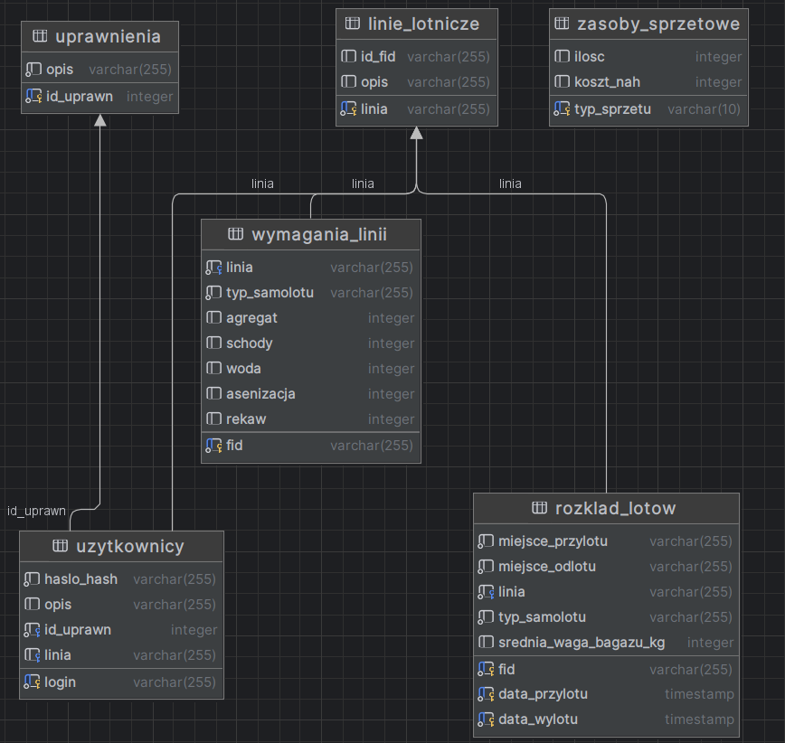

# Airport-GSE-database

PostgreSQL database of ground service equipment and its availability based on dynamicly created flight schedule.

## Structure

## Functionality
Example usage of chosen functions
### New airline

> SELECT dodajLinie('admin','LUFTHANSA','LU','Niemieckie linie lotnicze');

adds new Airline to _Linie_lotnicze_ table

### New flight requirements

>SELECT DodajNowyLot('admin','LU0013', 'LUFTHANSA', 'Boeing 787-9', 1, 1, 1, 1, 1);

>SELECT DodajNowyLot('admin','LU0014', 'LUFTHANSA', 'Boeing 787-9', 1, 1, 1, 6, 6);

adds new flight requirements

### Equpiement availability
>SELECT sprawdzdostepnoscsprzetu('admin','2024-01-01 13:00:00', '2024-01-01 15:00:00');

Check how many of each type of equipment is available in choosen period of time
### Add flight to schedule
>SELECT DodajCodziennyLot('admin','LU0014','LUFTHANSA', '2024-01-01 13:00:00', '2024-01-01 15:00:00', 'Warszawa', 'Berlin', 600, 2);

Define wich flight, when, how frequently and for how many weeks it should be added to flight schedule.
Also define destanation, and average luggage weight to calculate GSE requirements.

### Each user is assigned to an airline or airport staff and has it's own permissions

## Tests
 Most of the test scenarios are included in tests folder -
[Tests scenarios - pdf](https://github.com/Kurczaczek21/Airport-GSE-database/blob/main/tests/Tests-scenarios.pdf)

Additional tests were performed during the creation of functions.